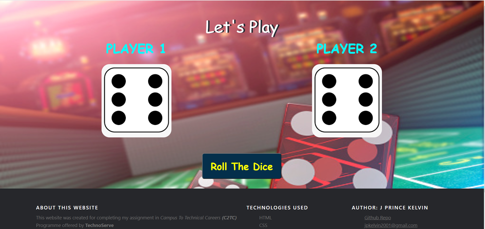
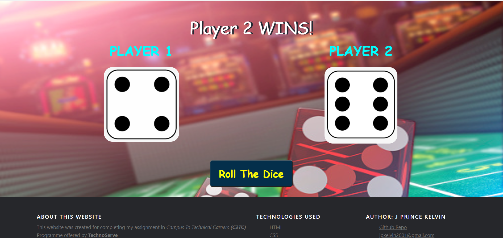

# Dice Game
This is a capstone project done as part of my internship at Gowri Software Solutions Pvt Ltd.

## Table of Content
  * [Demo](#demo)
  * [Problem Statement](#problem-statement)
  * [Technologies Used](#technologies-used)
  * [Installation](#installation)
  * [Directory Structure](#directory-structure)
  * [Bugs & Logs](#bugs--logs)
  * [Future scope of project](#future-scope)

## Demo
Link: [Play Demo](https://jpkelvin.github.io/Dice-Game/index.html)



## Problem Statement
```
Create a Simple website for Dice Game.
```

## Technologies Used
 
   1. HTML 
   2. CSS
   3. JavaScript
   4. Bootstrap

## Installation

No installation is required, just clone the repository using the command below and use it.
```bash
git clone https://github.com/jpkelvin/Dice-Game.git
```

## Directory Structure 
```
├── images 
├── script 
│   ├── script.js
├── style 
│   ├── style.css
├── index.html
├── README.md
```


## Bugs & Logs

1. If you find a bug, kindly open an issue and it will be addressed as early as possible. [Open](https://github.com/jpkelvin/Dice-Game/issues)

## Future Scope

* improve Frontend Design
* Add more interactivity to the webpage
* Optimize the Game by adding more features
